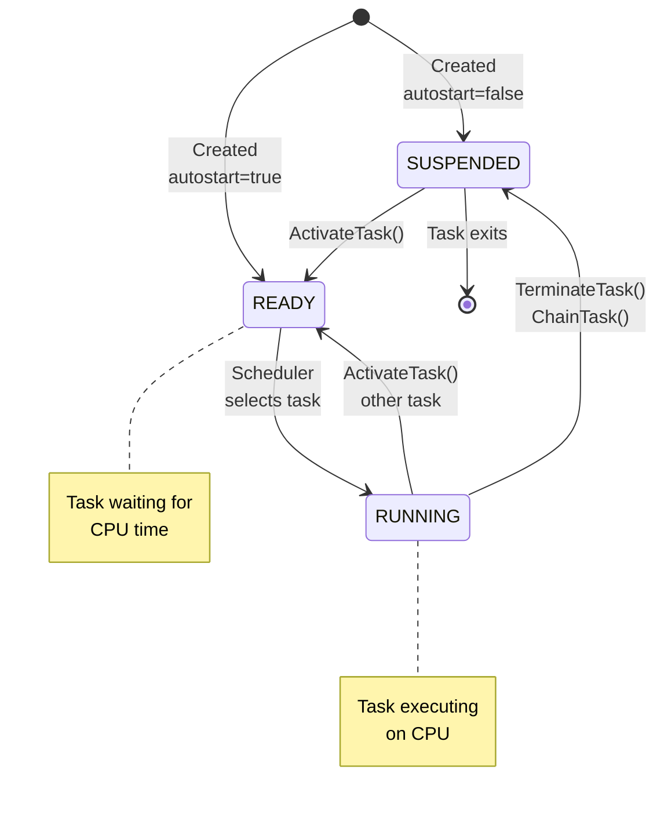
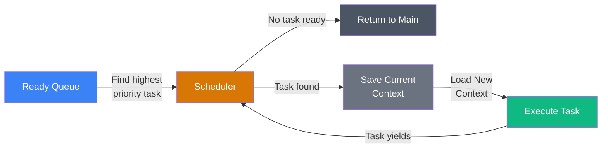
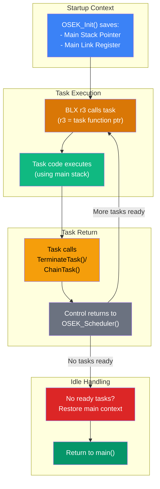
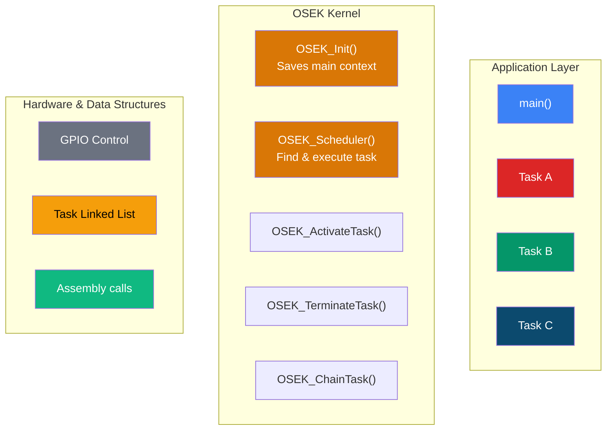
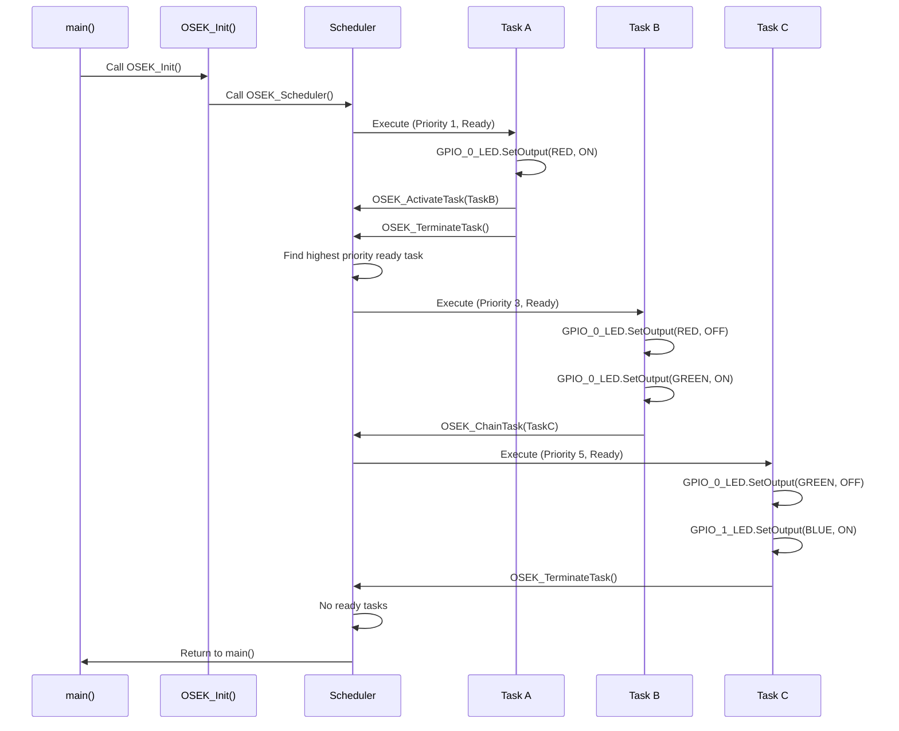
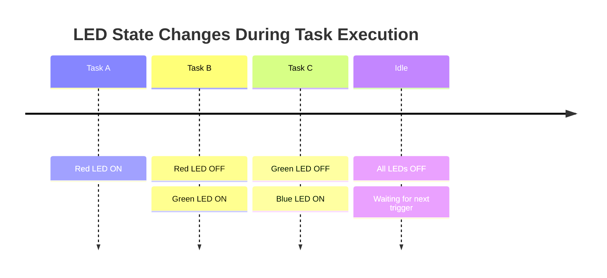

# CMSIS GPIO Button Toggle LED with OSEK Kernel

A real-time operating system kernel (OSEK) implementation for the NXP FRDM-MCXn947 board that manages multi-task execution with LED control via GPIO.

## Project Overview

This project demonstrates a lightweight OSEK implementation running on the ARM Cortex-M33 core. The system creates three tasks with different priorities that execute sequentially to control RGB LEDs on the development board.

**Hardware:** NXP FRDM-MCXN947 (ARM Cortex-M33)  
**RTOS:** Custom OSEK Kernel with priority-based scheduling  
**Build System:** CMake 

---

### Task Details

| Task | Priority | State | Function |
|------|----------|-------|----------|
| **Task A** | 1 (Lowest) | Auto-start | Turns ON red LED, activates Task B |
| **Task B** | 3 (Mid) | Suspended | Turns OFF red, turns ON green LED, chains to Task C |
| **Task C** | 5 (Highest) | Suspended | Turns OFF green, turns ON blue LED |

---

## Task State Machine

Each task transitions through different states during its lifecycle:



---

## Priority-Based Scheduling

The scheduler implements a **non-preemptive** priority-based algorithm:



**Scheduling Rules:**
- Higher priority number = higher priority
- Task with **highest priority** executes first
- Task executes until it calls `OSEK_TerminateTask()` or `OSEK_ChainTask()`
- Scheduler invoked after task yields

---

## Context Switching Architecture

The kernel preserves the main() context at startup and uses **ARM BLX instruction** for task invocation, allowing tasks to return control to the scheduler:



### Context Preservation Strategy

Instead of per-task stacks, the kernel uses a **main context preservation** approach:

```c
// Saved at startup in OSEK_Init()
static uint32_t g_main_stack_pointer = 0;  // SP of main()
static uint32_t g_main_link_register = 0;  // Return address to main()

// Task invocation via BLX (Branch with Link and Exchange)
// Automatically: LR = return address, jumps to task
// Task return: BX LR returns to OSEK_Scheduler()
```

---

## Kernel Architecture



---

## Task Execution Sequence

Detailed execution timeline showing how tasks flow through the system:



---

## LED Output Timeline



---

## File Structure

```
.
├── cmsis_button_toggle_led.c    # Application entry point & task definitions
├── OSEK.c                        # Kernel implementation (scheduler, context switching)
├── OSEK.h                        # Kernel headers & data structures
├── CMakeLists.txt               # Build configuration
├── CMakePresets.json            # CMake presets for MCUXpresso
├── button_toggle_led/           # Board configuration
├── frdmmcxn947_cm33_core0/       # Device-specific configuration
└── debug/                       # Build output (excluded from git)
```

---

## Building the Project

### Prerequisites
- MCUXpresso extension for VSCode
- ARM GCC Compiler
- CMake 3.20+
- (All installed with the VSCode extension)


---

## Key Implementation Details

### 1. Main Context Preservation at Startup
The kernel saves the main() execution context during initialization:

```c
void OSEK_Init(void) {
    __asm volatile (
        "mov r0, sp\n"
        "ldr r1, =g_main_stack_pointer\n"
        "str r0, [r1]\n"               // Save main's SP
        "mov r0, lr\n"
        "ldr r1, =g_main_link_register\n"
        "str r0, [r1]\n"               // Save main's LR (return address)
    );
    OSEK_Scheduler();
}
```

### 2. Task Invocation via BLX Instruction
Tasks are called using the ARM **BLX** (Branch with Link and eXchange) instruction, which automatically saves the return address:

```c
__asm volatile (
    "ldr r3, =g_task_to_run_pf\n"      // Load task function pointer
    "ldr r3, [r3]\n"
    "blx r3\n"                         // Call task, LR = return address
);
// Control returns here when task returns
```

When the task calls `OSEK_TerminateTask()` or `OSEK_ChainTask()`, execution returns to the scheduler loop.

### 3. Idle State Recovery
When no tasks are ready, the kernel restores main() context to return cleanly:

```c
if (highest_priority_task_sp == NULL) {
    __asm volatile (
        "ldr r0, =g_main_stack_pointer\n"
        "ldr r0, [r0]\n"
        "mov sp, r0\n"                 // Restore main's SP
        "ldr r0, =g_main_link_register\n"
        "ldr r0, [r0]\n"
        "bx r0\n"                      // Return to main()
    );
}
```

### 4. Priority-Based Scheduler
The scheduler scans the ready task list and executes the highest priority task:

```c
uint8_t max_priority_found = 0;
OSEK_Task_t *highest_task = NULL;

// Find highest priority ready task
for each task in ready queue:
    if task.priority > max_priority_found:
        max_priority_found = task.priority
        highest_task = task
```

---

## API Reference

### Task Management

| Function | Description |
|----------|-------------|
| `OSEK_Init()` | Initialize kernel and start scheduler |
| `OSEK_CreateTask()` | Create a new task with priority and auto-start flag |
| `OSEK_ActivateTask()` | Move suspended task to ready state |
| `OSEK_TerminateTask()` | Terminate current running task |
| `OSEK_ChainTask()` | Terminate current task and activate another |

### Example Usage

```c
// Create tasks
task_a_ptr = OSEK_CreateTask(task_a, 1, true);   // Priority 1, auto-start
task_b_ptr = OSEK_CreateTask(task_b, 3, false);  // Priority 3, suspended
task_c_ptr = OSEK_CreateTask(task_c, 5, false);  // Priority 5, suspended

// Initialize and start kernel
OSEK_Init();
```

---

## Limitations & Future Improvements

### Current Limitations
- **Non-preemptive scheduling:** Tasks cannot be interrupted (must yield)
- **No time slicing:** No round-robin scheduling
- **Limited to 10 tasks:** `MAX_TASKS` defined at compile-time
- **Single shared stack:** All tasks share the main() stack (potential overflow risk with deep nesting)
- **Dynamic allocation:** Uses `malloc()` for task creation (limited by heap size)

### Recommended Improvements
- [ ] Add preemptive scheduling support (SysTick interrupt)
- [ ] Add semaphore/mutex support for task synchronization
- [ ] Implement task stack allocation for isolation
- [ ] Event/interrupt handling for external devices

---

## Repository Setup

### Initial Commit
```bash
git init
git add .
git commit -m "Initial commit: OSEK kernel with task scheduling"
git remote add origin https://github.com/yourusername/repo.git
git push -u origin main
```

---

## References

- [NXP MCXn947 Data Sheet](https://docs.nxp.com/bundle/UM12018/page/topics/related_documentation.html)
- [ARM Cortex-M  Assembly Programming Guide](https://developer.arm.com/documentation/100235/0003/the-cortex-m33-instruction-set/cortex-m33-instructions)

---

## License

Copyright 2024 NXP  
SPDX-License-Identifier: BSD-3-Clause

---

## Author

Diego & Romulo - OSEK Kernel Implementation  
**Created:** January 24, 2026  
**Last Updated:** February 6, 2026
