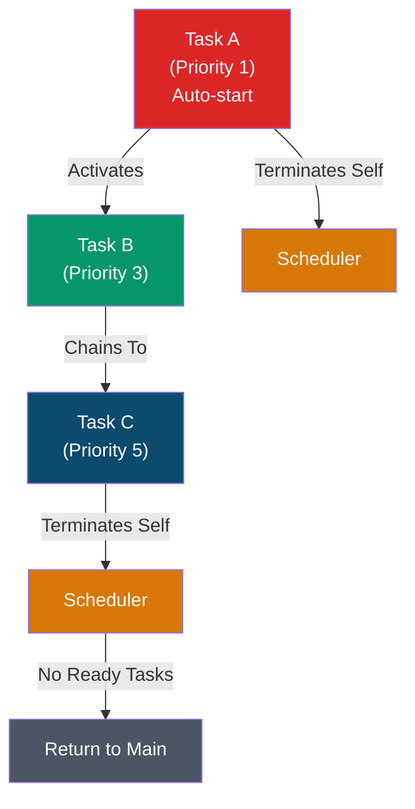
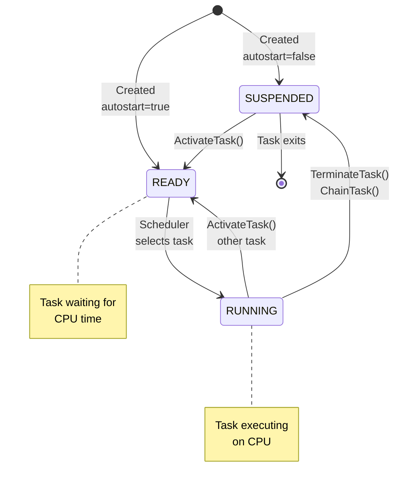
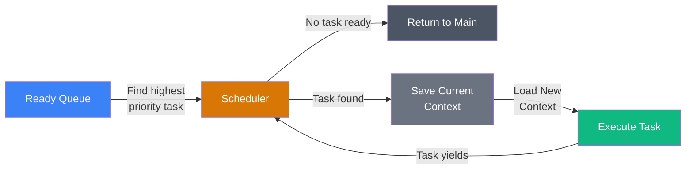
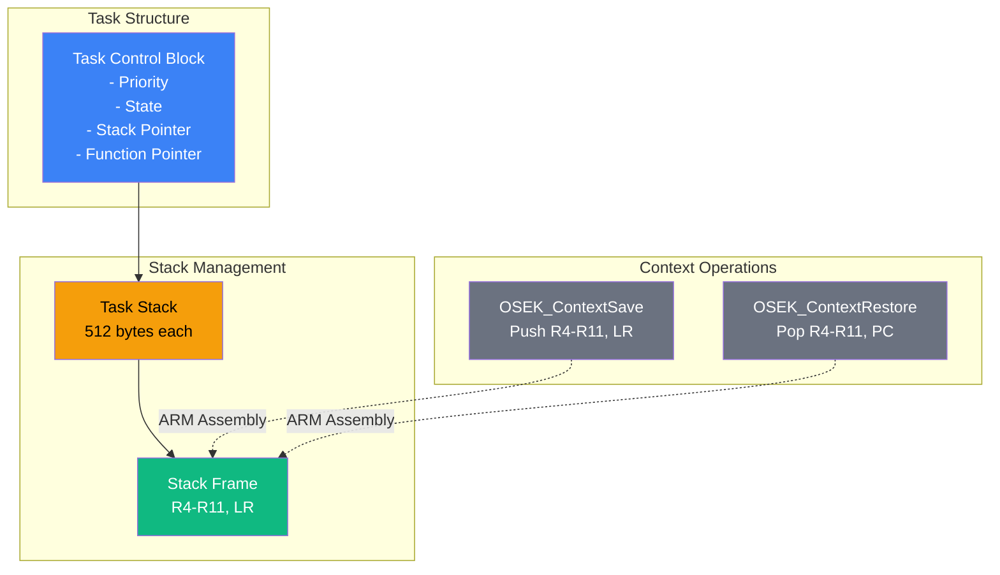
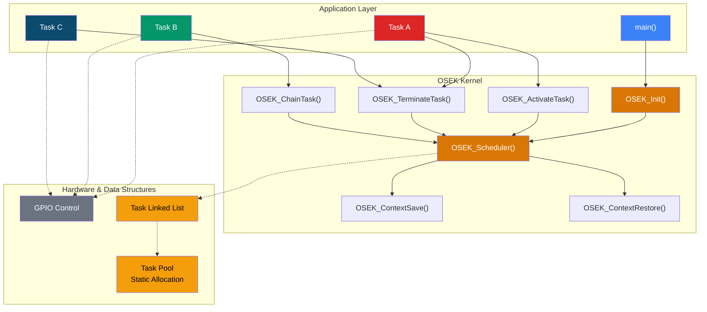
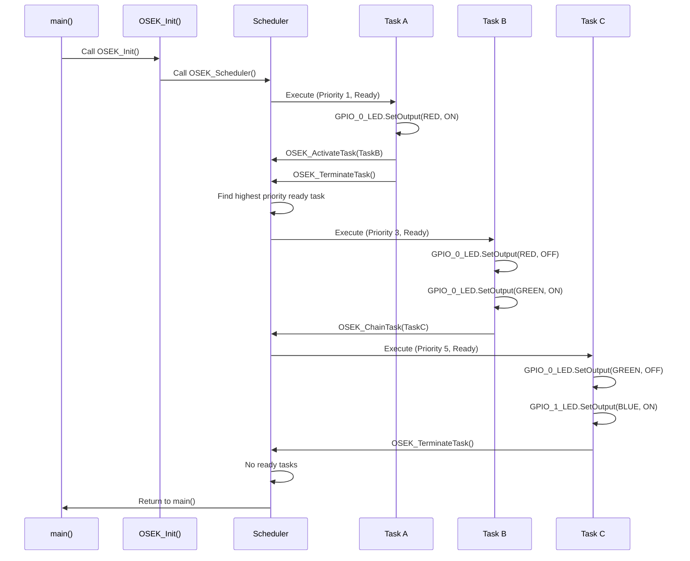
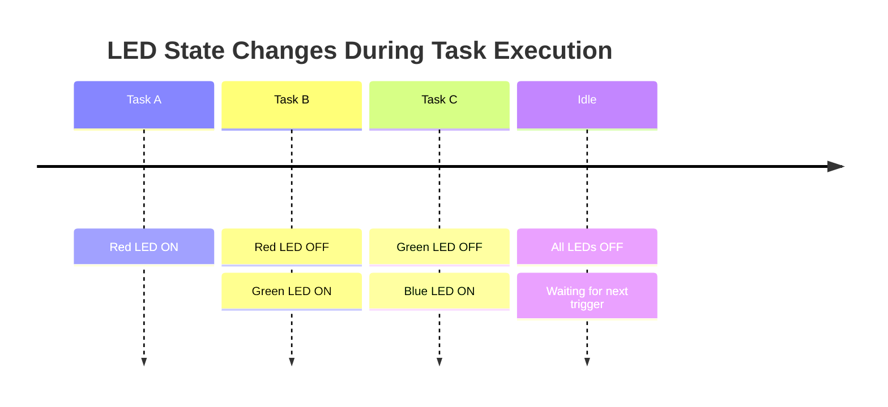

# CMSIS GPIO Button Toggle LED with OSEK Kernel

A real-time operating system kernel (OSEK) implementation for the NXP FRDM-MCXn947 board that manages multi-task execution with LED control via GPIO.

## Project Overview

This project demonstrates a lightweight OSEK (AUTOSAR Operating System Embedded Kernel) implementation running on the ARM Cortex-M33 core. The system creates three tasks with different priorities that execute sequentially to control RGB LEDs on the development board.

**Hardware:** NXP FRDM-MCXn947 (ARM Cortex-M33)  
**RTOS:** Custom OSEK Kernel with priority-based scheduling  
**Build System:** CMake (MCUXpresso compatible)  

---

## Task Execution Flow



### Task Details

| Task | Priority | State | Function |
|------|----------|-------|----------|
| **Task A** | 1 (Lowest) | Auto-start | Turns ON red LED, activates Task B |
| **Task B** | 3 (Mid) | Suspended | Turns OFF red, turns ON green LED, chains to Task C |
| **Task C** | 5 (Highest) | Suspended | Turns OFF green, turns ON blue LED |

---

## Task State Machine

Each task transitions through different states during its lifecycle:



---

## Priority-Based Scheduling

The scheduler implements a **non-preemptive** priority-based algorithm:



**Scheduling Rules:**
- Higher priority number = higher priority
- Task with **highest priority** executes first
- Task executes until it calls `OSEK_TerminateTask()` or `OSEK_ChainTask()`
- Scheduler invoked after task yields

---

## Context Switching Architecture

The kernel uses **manual stack-based context switching** with per-task stacks:



### Stack Frame Structure

Each task's stack frame stores the CPU context:

```c
typedef struct {
    uint32_t r4;    // Callee-saved register
    uint32_t r5;    // Callee-saved register
    uint32_t r6;    // Callee-saved register
    uint32_t r7;    // Callee-saved register
    uint32_t r8;    // Callee-saved register
    uint32_t r9;    // Callee-saved register
    uint32_t r10;   // Callee-saved register
    uint32_t r11;   // Callee-saved register
    uint32_t lr;    // Return address / Program Counter
} OSEK_StackFrame_t;
```

---

## Kernel Architecture



---

## Task Execution Sequence

Detailed execution timeline showing how tasks flow through the system:



---

## LED Output Timeline



---

## File Structure

```
.
├── cmsis_button_toggle_led.c    # Application entry point & task definitions
├── OSEK.c                        # Kernel implementation (scheduler, context switching)
├── OSEK.h                        # Kernel headers & data structures
├── CMakeLists.txt               # Build configuration
├── CMakePresets.json            # CMake presets for MCUXpresso
├── button_toggle_led/           # Board configuration
├── frdmmcxn947_cm33_core0/       # Device-specific configuration
└── debug/                       # Build output (excluded from git)
```

---

## Building the Project

### Prerequisites
- MCUXpresso IDE
- ARM GCC Compiler
- CMake 3.20+

### Build Commands

**Using CMake:**
```bash
mkdir build
cd build
cmake -G Ninja -DCMAKE_BUILD_TYPE=Debug ..
cmake --build .
```

**Using MCUXpresso:**
1. Open MCUXpresso IDE
2. Import project: `File` → `Import` → `Existing Projects into Workspace`
3. Select the project folder
4. Build: `Project` → `Build All` or `Ctrl+B`

---

## Key Implementation Details

### 1. Static Task Pool Allocation
Instead of using `malloc()` for each task (which exhausts heap), tasks are allocated from a pre-allocated static pool:

```c
static OSEK_Task_t g_task_pool[MAX_TASKS];  // Compile-time allocation
static uint32_t g_task_pool_idx = 0;        // Track allocation index
```

### 2. Context Switching with Naked Assembly
Callee-saved registers (R4-R11) and return address (LR) are manually saved/restored using ARM inline assembly:

```c
__attribute__((naked)) static void OSEK_ContextSave(void) {
    __asm volatile (
        "push {r4-r11, lr}\n"
        "ldr r0, =g_actual_task_sp\n"
        "ldr r0, [r0]\n"
        "str sp, [r0, #20]\n"  // Save SP to task struct
        "bx lr\n"
    );
}
```

### 3. Priority-Based Scheduler
The scheduler scans the ready task list and executes the highest priority task:

```c
uint8_t max_priority_found = 0;
OSEK_Task_t *highest_task = NULL;

// Find highest priority ready task
for each task in ready queue:
    if task.priority > max_priority_found:
        max_priority_found = task.priority
        highest_task = task
```

---

## API Reference

### Task Management

| Function | Description |
|----------|-------------|
| `OSEK_Init()` | Initialize kernel and start scheduler |
| `OSEK_CreateTask()` | Create a new task with priority and auto-start flag |
| `OSEK_ActivateTask()` | Move suspended task to ready state |
| `OSEK_TerminateTask()` | Terminate current running task |
| `OSEK_ChainTask()` | Terminate current task and activate another |

### Example Usage

```c
// Create tasks
task_a_ptr = OSEK_CreateTask(task_a, 1, true);   // Priority 1, auto-start
task_b_ptr = OSEK_CreateTask(task_b, 3, false);  // Priority 3, suspended
task_c_ptr = OSEK_CreateTask(task_c, 5, false);  // Priority 5, suspended

// Initialize and start kernel
OSEK_Init();
```

---

## Limitations & Future Improvements

### Current Limitations
- **Non-preemptive scheduling:** Tasks cannot be interrupted (must yield)
- **No time slicing:** No round-robin scheduling
- **Limited to 10 tasks:** `MAX_TASKS` defined at compile-time
- **Fixed stack size:** All tasks have 512-byte stacks

### Recommended Improvements
- [ ] Add preemptive scheduling support (SysTick interrupt)
- [ ] Implement time-slicing for fairness
- [ ] Add semaphore/mutex support for task synchronization
- [ ] Dynamic stack size configuration
- [ ] Event/interrupt handling for external devices
- [ ] Task priority inheritance mechanisms

---

## Repository Setup

### .gitignore
```gitignore
# Build directories
debug/
release/
build/

# IDE files
.cproject
.project
.settings/
.mcuxpressoide_project_cache/

# CMake artifacts
CMakeCache.txt
CMakeFiles/
cmake_install.cmake
compile_commands.json
```

### Initial Commit
```bash
git init
git add .
git commit -m "Initial commit: OSEK kernel with task scheduling"
git remote add origin https://github.com/yourusername/repo.git
git push -u origin main
```

---

## References

- [AUTOSAR OSEK Specification](https://www.autosar.org/)
- [NXP MCXn947 Data Sheet](https://www.nxp.com/)
- [ARM Cortex-M Programming Guide](https://developer.arm.com/)
- [MCUXpresso IDE Documentation](https://www.nxp.com/mcuxpresso)

---

## License

Copyright 2024 NXP  
SPDX-License-Identifier: BSD-3-Clause

---

## Author

Diego - OSEK Kernel Implementation  
**Created:** January 24, 2026  
**Last Updated:** February 6, 2026
